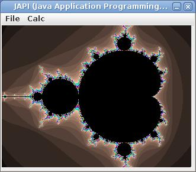

Moy
---

Build|Linux|Windows|Coverity|Coverage|Codecov|Quality|Alerts
---|---|---|---|---|---|---|---
status|||||||

This project implements a variant of [Joy](https://github.com/Wodan58/joy1).
Conditions do not restore the stack to what it was before the condition
started. This project uses the
[BDW garbage collector](https://github.com/ivmai/bdwgc) and
[JAPI](https://github.com/maxstrauch/japi2-kernel).
JAPI is under the LGPL license, see LICENSE.txt

Changes
-------

Most builtins of Joy are supported in Moy.
Some other ones have been added: casting, fget, filetime, getch, identical,
in1, index, over, pick, poke, round, and sametype.
The build system requires new builtins in only one location: as a .c file in
the src-directory or the gui-directory.

Installation
------------

Run:

    cmake .
    cmake --build .

And:

    java -jar JAPI.jar &
    ./joy mandel.joy

This last test results in:

Mandelbrot in full Swing.
